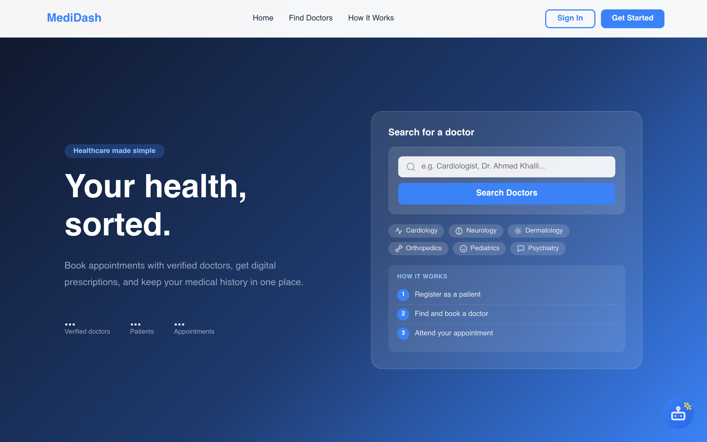
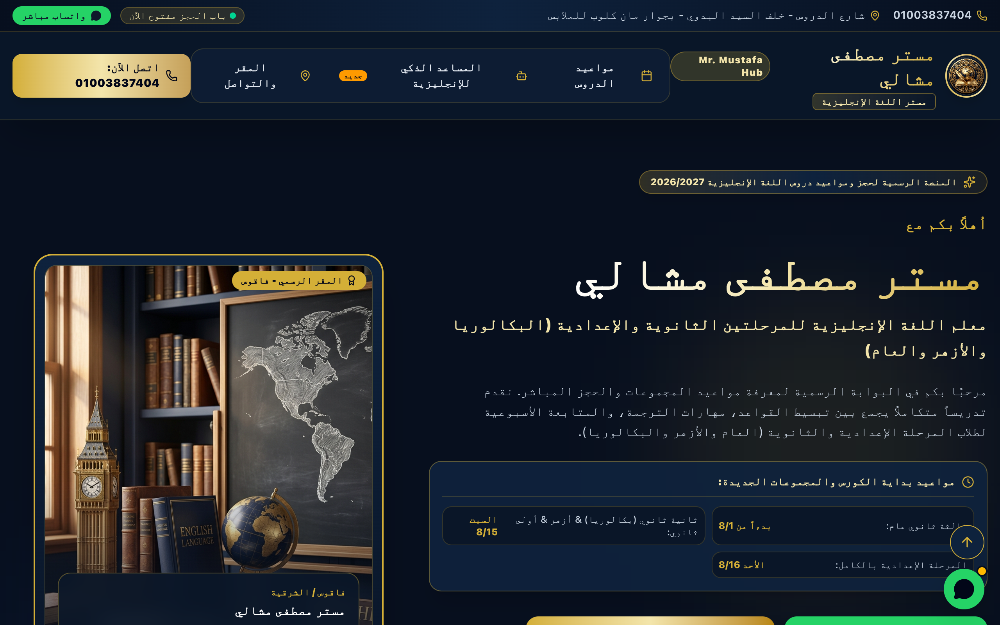

# Abdelrahman Sabry — Portfolio

> Front-end engineer building clear, responsive interfaces with React and TypeScript.

[](https://por-one-nu.vercel.app)
[](https://github.com/abdelrahmansabry85/abdelrahman-sabry-portfolio)
[](https://react.dev/)

## Overview

A one-page personal portfolio for Abdelrahman Sabry, a front-end engineer and data engineering trainee. The site presents selected web projects, a practical toolset, services, a downloadable CV, and direct contact links in one focused experience.

The visual direction is dark and editorial, with a light-mode alternative, an animated front-end stack orbit, real project screenshots, icon-based tool cards, smooth section transitions, and responsive layouts for mobile and desktop.

## Featured work

| Project | Description | Live site |
| --- | --- | --- |
| **MediDash** | Online medical system focused on doctor discovery, bookings, records, and an AI assistant. | [Open project](https://la-phi.vercel.app/) |
| **Mostafa Teacher Hub** | Arabic-first information site for a teacher's schedule, address, timing, and AI-powered revision quizzes. | [Open project](https://mrmostafamashaly.vercel.app/) |

### Project screenshots

<p>
  
  
</p>

Each project includes a case-study expansion with the role, intended outcome, project context, and technology details.

## What is included

- About section focused on front-end engineering and practical English-education support
- Selected work with real landing-page screenshots, live links, and expandable case studies
- Animated stack marquee and icon-based tools grid
- Services for front-end engineering, data cleaning, technical content, and presentations
- One-page resume section with a branded CV download
- Email, WhatsApp, LinkedIn, and X contact links
- Dark and light themes with persisted preference (no flash on load)
- Responsive layout for mobile, tablet, and desktop
- SEO essentials: Open Graph/Twitter cards, canonical URL, and JSON-LD structured data
- Accessibility: skip-to-content link, visible focus states, reduced-motion support, keyboard-friendly navigation

## Technology

- React 19 + TypeScript
- Vite
- React Icons
- HTML5 and CSS3
- Vercel deployment

## Run locally

Requirements: Node.js 20+ and npm.

```bash
git clone https://github.com/abdelrahmansabry85/abdelrahman-sabry-portfolio.git
cd abdelrahman-sabry-portfolio
npm install
npm run dev
```

Open the local URL shown by Vite, usually `http://localhost:5173`.

## Validate a production build

```bash
npm run build
npm run preview
```

The build runs TypeScript checks before generating the production files in `dist/`.

## Deployment

The production site is deployed on Vercel and connected to the GitHub `main` branch. Every push to `main` triggers a new deployment automatically — no manual steps needed.

To connect it yourself (if not already linked):

1. Push the project to this GitHub repository.
2. Go to [vercel.com/new](https://vercel.com/new) and import the `abdelrahman-sabry-portfolio` repository.
3. Vercel detects Vite via [`vercel.json`](./vercel.json) (`npm run build`, output `dist/`) — just click **Deploy**.
4. From then on, every push to `main` deploys automatically, and every pull request gets a preview URL.

## Project files

```text
src/
  App.tsx        Page sections, content, interactions, and project data
  styles.css     Responsive visual system, themes, and animations
  main.tsx       React entry point
public/
  documents/     Downloadable CV
  *.png          Real project landing-page screenshots
```

## Documents

- [Branded CV (PDF)](./public/documents/Abdelrahman-Sabry-CV.pdf)

## Contact

- Email: [mobodymo6@gmail.com](mailto:mobodymo6@gmail.com)
- WhatsApp: [Message on WhatsApp](https://wa.me/201553258929)
- LinkedIn: [Abdelrahman Sabry](https://www.linkedin.com/in/abdelrahman-sabry-b36500275/)
- X: [@abosabrynbo](https://x.com/abosabrynbo)

## License

This is a personal portfolio repository. No open-source license is currently declared; please contact Abdelrahman before reusing personal content, documents, or project assets.
